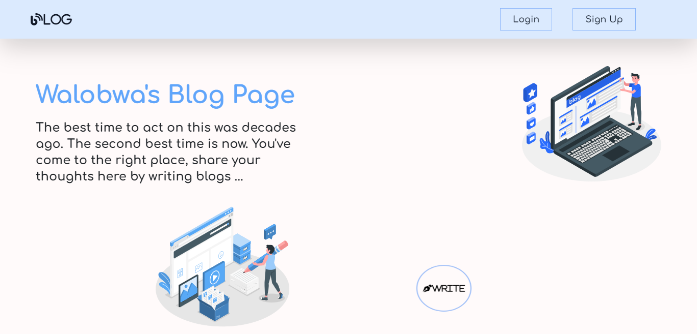
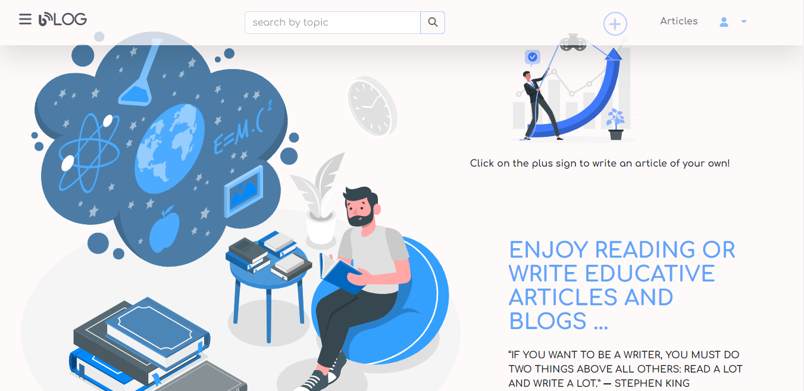

<h1 align="center">Walobwa's Blog Page</h1>

Decided to create my own blog page where I would be posting my articles since I thought of trying out technical writing

<h3>Overview:</h3>
<h4>Landing Page<h4>

    

 
<h4>HomeView Page</h4>

    

 

 
<h4>Powered by: </h4>

      

